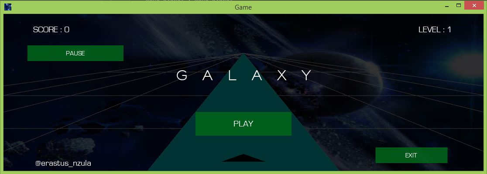
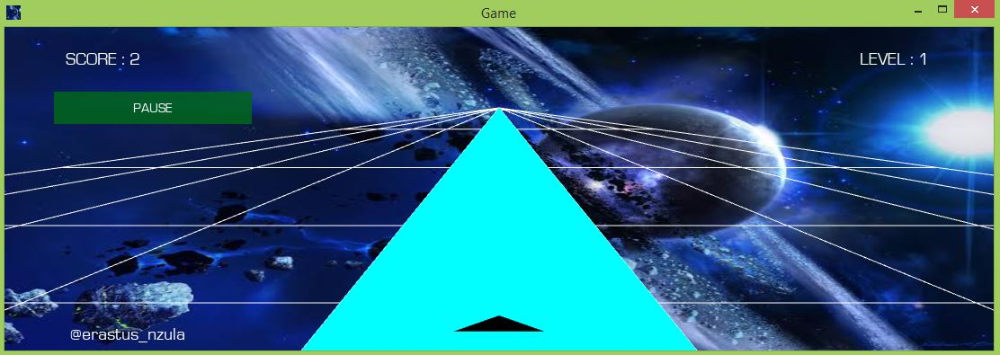

Galaxy Game
===========
Galaxy is a simple game that requires the player to follow a designated path.
The game is made using the python kivy framework that allow creation of applications
that can run across all platforms (desktop, mobile and tablets).
Galaxy can be played on both desktop, tablet, mobile platforms using the same source code.
The game presents a user-friendly interface with buttons that functions as described
(pause, play, exit).

Galaxy uses customized sounds that plays according to the game state.
The user can pause/unpause the game using the pause button
on mobile and tablets, the space bar key on desktop platforms.

The only third party module used is the kivy framework that can be installed using
`pip install kivy` in case of problems installing kivy try installing it step by step
following the described steps in its installation manual
https://kivy.org/doc/stable/gettingstarted/installation.html
N/B: Kivy is not supported in python 3.10 and above make sure to have python 3.9 
and below installed in your system.
Build modules to import are `sys and random`.

Play Galaxy Game
================
Get a GitHub copy of the game by forking the repository and clone the repository to get a local
copy of the game on your machine using the command `git clone` https://github.com/erastusnzula/Python-kivy-galaxy
or download zip, the run the `main.py` file.

Contribution
============
All contributions are welcomed, feel free to open issues and share ideas on how to make the
game more interesting.

Author
======
Name : Erastus Nzula
Twitter : @erastus_nzula.

